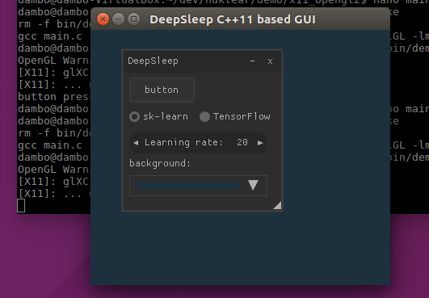

# DeepSleep Machine and Deep Learning experiments manager. 

**DeepSleep (WORK IN PROGRESS)** is a lightweight Machine and Deep Learning experiments manager for Data Sceintists written using C++11 and Python.

DeepSleep is intended to provide, you, the data scientist, an open source environment for managing all your Data Science Experiments. DeepSleep allowes you to monitor the historical scores and results of your ML experiments.
It is targeted at both the academia and free for use also commercially. The idea was born out of my own experimnets and participation in Kaggle and Numer.ai. The UI is born out of my interest in Cross platform GUI’s, and therefore I opted for NanoGUI (https://github.com/wjakob/nanogui), a C++11 based UI framework.

The Server itself is based on Flask, Celery, Flower and Redis (see below). 

## Core features
- Run ML/DL Models using open source libraries such as sk-learn, xgboost and TensorFlow
- Automatic grid/random/bayesian search for hyperparameter optimization.
- Server based on Flask and Celery (Python)
- ML model results and any other historical artefacts are persisted to a Data Base (Postgres)

## High Level Diagram

## Goodies
In addition to the core functionality, DeepSleep provides some extra goodies:
- Open Source! 
- Written by a Data Scientist for Data Scientists. 
- A modern GUI based on NanoGUI (C++11) https://github.com/wjakob/nanogui
- This project is self contained in one single Docker image

## About

This project was created by [QuantScientist]https://github.com/QuantScientist/).
Significant features and/or improvements to the code were contributed by:

### License

DeepSleep is provided under a BSD-style license that can be found in the
``LICENSE`` file. By using, distributing, or contributing to this project,
you agree to the terms and conditions of this license.
