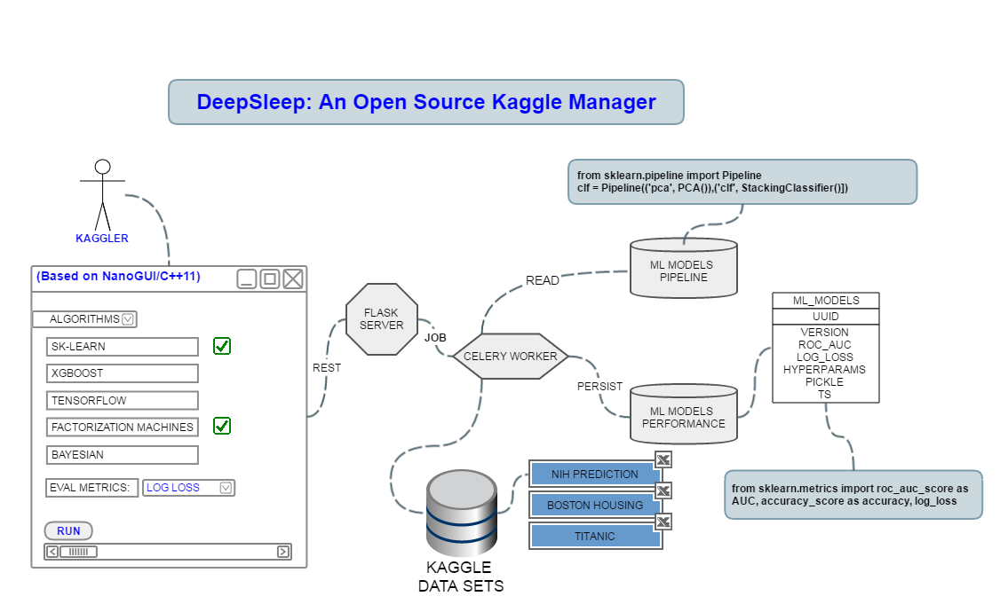

# DeepSleep
Machine and Deep Learning experiments manager for Kaggle using C++11 and Python 

**DeepSleep (WORK IN PROGRESS)** is a lightweight Machine and Deep Learning experiments manager for Kaggle.

## Core features
- GUI based on NanoGUI (C++11)
- Server based on Flask and Celery 

## Goodies
In addition to the core functionality, DeepSleep provides some extra goodies:

- 
- 

## About

This project was created by [QuantScientist]https://github.com/QuantScientist/).
Significant features and/or improvements to the code were contributed by:

### License

DeepSleep is provided under a BSD-style license that can be found in the
``LICENSE`` file. By using, distributing, or contributing to this project,
you agree to the terms and conditions of this license.
